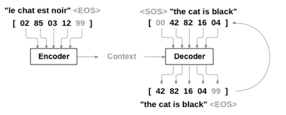
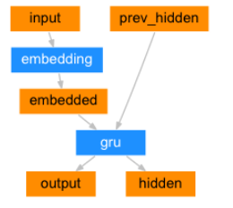
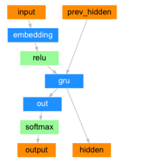
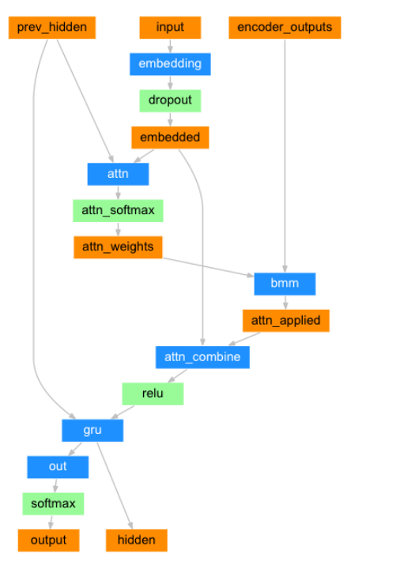
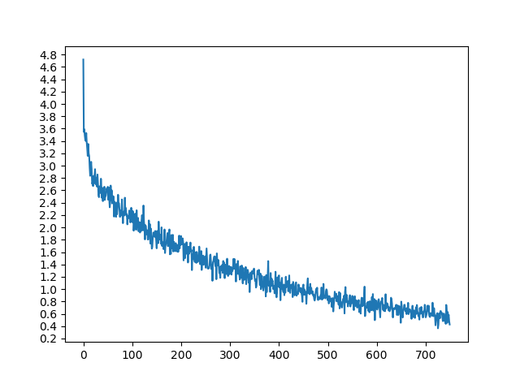
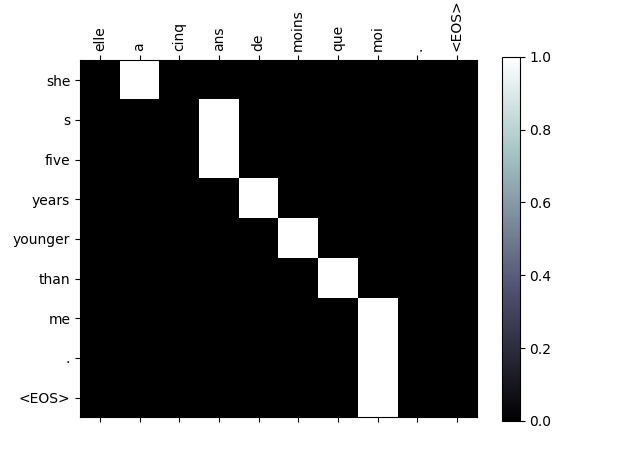

# Translation with a Sequence to Sequence Network and attention

##model
the seq2seq model's basic idea

the encoder

the decoder

attention decoder

## train
训练过程中的loss

attention的可视化

##resource
[1] [pytorch 官方教程](http://pytorch.org/tutorials/intermediate/seq2seq_translation_tutorial.html)